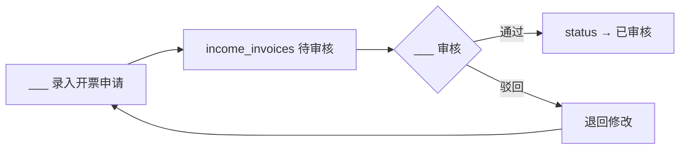
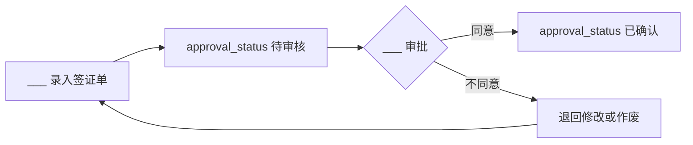
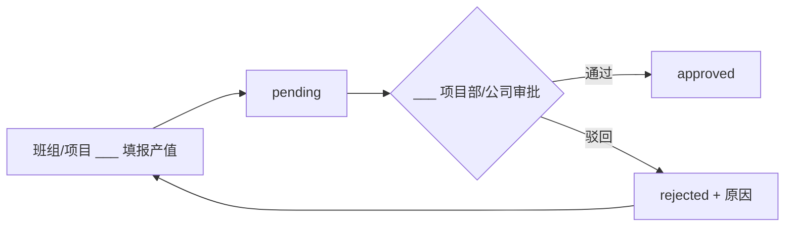
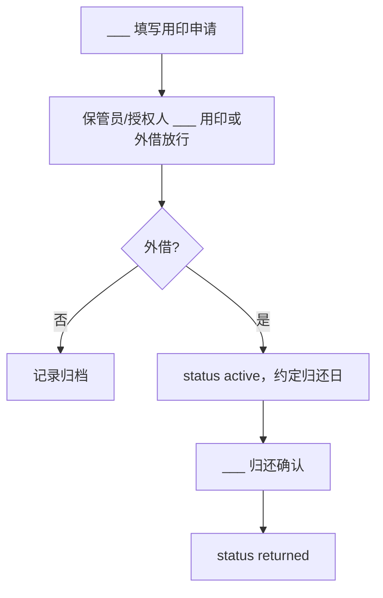

# 核心业务：录入顺序、审批与锁定说明

本文档用于约定 **谁先录入、谁审批、何时锁定**，避免在「财务 / 合同签证 / 劳务产值 / 用印」等多菜单重复录入且数据不一致。文中 **角色名称留空**（如「___录入」），请贵司按实际岗位填入。

**与系统实现的对应关系**：下列流程结合了当前前端页面与数据库字段习惯用法；若界面未强制分离账号权限，则 **制度上** 仍需约定职责分离，必要时再通过 Supabase RLS 或审批角色加固。

---

## 1. 财务：开票、收付款、未开票

### 1.1 菜单与数据关系（避免重复录入）

| 菜单路径（示例） | 主要用途 | 与其它菜单的关系 |
|------------------|----------|------------------|
| 财务 → 开票登记 / 发票开具 | 登记开出给甲方的发票，`income_invoices` 新建通常为 **待审核** | **勿**在「发票列表」再手写一套金额；以开具页或列表编辑为准 |
| 财务 → 发票列表 | 查询、编辑开票记录，`status` 含 **已审核** 等 | 审核通过后视为对外口径一致 |
| 财务 → 收款登记 | 登记银行到账等，通常 **有效** | 与开票可对账，但不代替开票录入 |
| 财务 → 工程款支付（登记） | **申请** → **确认付款**：`payment_records` 存在 **待处理 / 已完成** | **勿**对同一笔付款既走「支付管理」又走「支付登记」两条线；选定一条为主数据 |
| 财务 → 未开票款项 | 承接「未开票先付款」类已完成付款，补发票与催收 | 数据源来自 `payment_records` 等已完成且待补票场景，**不在此重复新建一笔付款** |

### 1.2 建议流程（开票与审核）

**锁定建议**：发票一经 **已审核**，非授权岗位不得改金额与税额；变更走冲红/作废流程（由财务制度定义）。

### 1.3 建议流程（付款申请与确认）

开票状态选择 **已开票** 时需关联发票；**未开票先付款** 会在业务上进入后续「补票」闭环（见未开票款项）。

### 1.4 未开票闭环

**锁定建议**：补票完成后，该付款记录不应再在其它菜单被改成另一张发票号。

---

## 2. 合同变更 / 签证

对应页面：**合同收入 → 变更签证**（`income_variations`）、**合同支出 → 变更签证**（支出侧同理）；字段含 **审批状态**：**待审核** / **已确认**。

### 2.1 建议流程

**锁定建议**：**已确认** 后原则上锁定 **签证金额与关联主合同**；若工程仍需调整，走新增签证单或书面变更流程，避免在无痕迹情况下直接改原单行。

**注意**：当前界面可能对「录入」与「审批」使用同一编辑能力时，组织上应限定 **仅指定角色** 可将状态改为「已确认」。

---

## 3. 劳务产值上报与审批

对应菜单：**劳务 → 产值上报**（录入）、**劳务 → 产值审核**（审批）。系统中可见状态示例：**待审批 pending**、**已通过 approved**、**已驳回 rejected**。

### 3.1 建议流程

**锁定建议**：当月/当期产值 **审批通过后** 不再修改数额；差错调整通过下期冲减或签证说明处理。

---

## 4. 用印申请

对应菜单：**用印管理**；类型示例：**项目盖章**、**临时盖章**、**印章外借**（`seal_usage_records`）。外借记录存在 **active（未归还）** / **returned（已归还）**。

### 4.1 建议流程（盖章与外借）

**锁定建议**：外借记录 **归还确认（returned）** 后作为闭环存档；超期可由系统预警模块联动（见印章超期→预警）。

---

## 5. 跨模块一致性检查清单（上线或月结时使用）

1. **产值审批金额** 是否与 **形象进度 / 合同应收** 在同一项目口径下可解释。  
2. **签证「已确认」合计** 是否已反映在 **收入/支出合同执行额** 或结算逻辑中（按贵司结算规则）。  
3. **付款已完成** 且 **未开票先付款** 是否在 **未开票款项** 中闭环或有无遗漏。  
4. **开票「已审核」** 是否与收款、应收台账一致。  
5. **用印外借** 是否均为 **已归还**，未闭环项是否在预警中跟进。

---

## 6. 文档维护

| 变更类型 | 更新本文档 |
|----------|------------|
| 新增财务菜单或改变「待审核/已完成」含义 | 第 1 节与流程图 |
| 签证审批节点变化 | 第 2 节 |
| 劳务审批层级变化 | 第 3 节 |
| 用印保管与外借责任人变更 | 第 4 节 |

**修订记录**：首次编写对齐当前前端模块划分；后续以 Git 提交说明为准。
