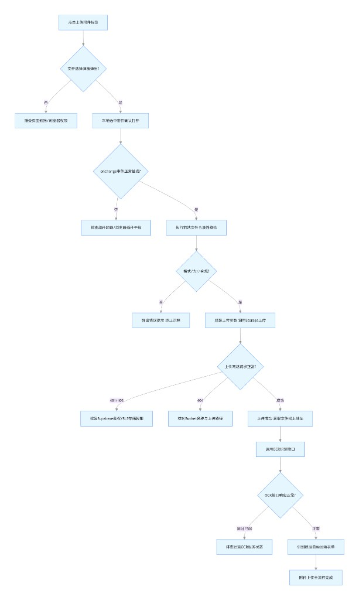
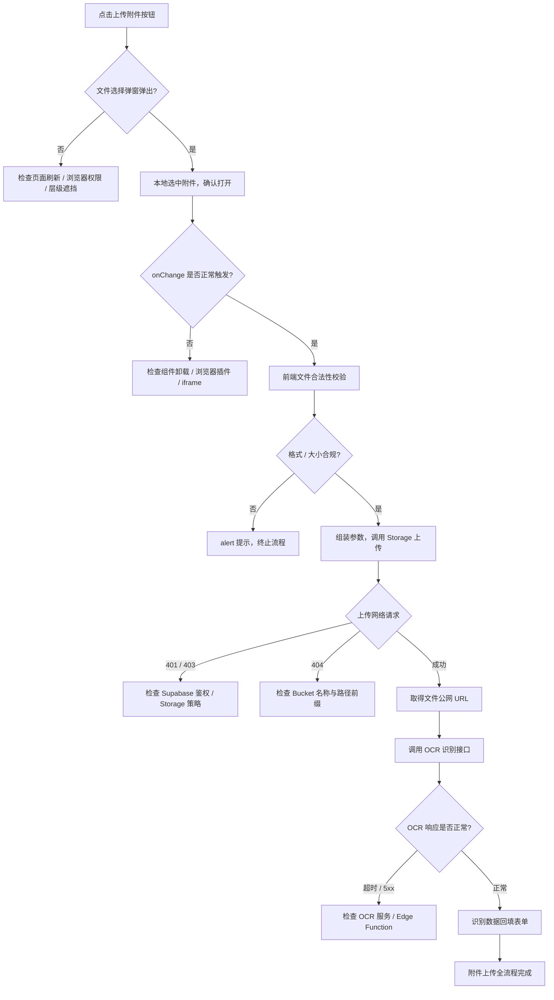

# 发票附件上传故障排查 SOP

## 1. 前置说明

### 1.1 技术架构

| 项 | 说明 |
|----|------|
| **触发方式** | `<label htmlFor>` 关联文件输入；**禁止**回退为旧版 `hidden` + `ref.click()` 唤起（部分浏览器不弹窗）。 |
| **事件绑定** | 原生 `<input type="file" onChange={handleFilesSelected} />` 统一接收文件列表（`src/pages/finance/InvoiceEntry.tsx`）。 |
| **上传链路** | 前端校验（大小、MIME/扩展名）→ **`file.arrayBuffer()`** 整包写入 Supabase Storage（**非** Storage 分片 API；多文件时为 **`Promise.all` 并行多请求**）→ `runOcr` → `runInvoiceOcr`（`src/services/invoiceOcrService.ts`）。 |
| **识别链路** | 若构建注入 `INVOICE_OCR_SERVICE_URL` 且带本地 `File`，则 `POST {base}/api/invoice/ocr`（**120s** 超时）；否则 `supabase.functions.invoke('invoice-ocr', { body: { fileUrls } })`。 |
| **异常机制** | `handleFilesSelected` 内 **`try/catch`**：`alert` 用户可读信息 + **`console.error('[InvoiceEntry] 附件上传或识别失败', err)`**（非全站 React Error Boundary 语义上的「全局」）。 |
| **权限架构** | 浏览器使用 **anon key + 用户 JWT** 访问 Supabase；Storage 写入受 **Bucket 是否存在、Storage Policies** 约束；表数据隔离另见 [`DATABASE_RLS.md`](./DATABASE_RLS.md)。 |

### 1.2 故障优先级排序（线上真实故障概率：高 → 低）

1. **Supabase Storage**：Bucket 名/路径、**401/403**、Storage 策略无写入权限、登录态异常。  
2. **文件校验**：MIME/扩展名不支持、超过 **10MB**（当前实现会 **`alert`**；仅 **`files` 为空列表直接 `return`** 时无提示，多见于取消选择）。  
3. **OCR 服务**：`INVOICE_OCR_SERVICE_URL` 不可达、混合内容、宕机；或本地请求**超时**（120s 后有提示）。  
4. **边缘函数 / 反代**：`invoice-ocr` **404/500**、反代丢失 **`Authorization`**（见仓库根目录 `.env.example` 中 `SUPABASE_FUNCTIONS_URL` 说明）、JWT 失效。  
5. **浏览器环境**：插件拦截、iframe、极端情况下事件未进 handler。  
6. **表单 `submit`**：未写 `type="button"` 的 `<button>` 触发表单提交刷新（本业务**极低**，上传入口为 `label` 已规避）。

### 1.3 排查流程图（与附件流程一致）

团队版流程图（已纳入仓库，便于离线文档 / 内网 Wiki 引用）：

下列 **Mermaid** 与上图等价；若**弹窗能开、选文件后无反应**，优先沿 **「onChange 是否触发」→「校验是否弹窗」→「Storage 状态码」** 分支排查。

---

## 2. 标准化排查步骤

### 步骤 1：基础现象判定

1. **点击上传区域**：文件选择器能否弹出？  
   - **不能**：浏览器对文件选择的限制、页面层级遮挡、`z-index`、或仍存在的非标准唤起方式（应回到 `label` + 可见 `sr-only` input 方案排查）。  
   - **能**：进入下一步。  

2. **选中文件并确认**：是否有 **`alert`**、Console 是否有 **`[InvoiceEntry]`** 相关日志？  
   - **全无**：`onChange` 未触发，或 **`if (!list?.length) return`**（空列表）；可在 `handleFilesSelected` 首行临时 **`console.log`** 验证。  
   - **有报错/弹窗**：按文案与堆栈定位（Storage / 格式 / OCR）。  

### 步骤 2：前端日志（F12 → Console）

1. 是否出现 **`[InvoiceEntry] 附件上传或识别失败`** 及完整 `Error`。  
2. 检索关键词：`size`、`type`、`timeout`、`storage`、`permission`、`AbortError`（本地 OCR 超时）。  
3. **无任何日志**：确认是否进入 `handleFilesSelected`；排除扩展清空控制台、过滤级别。  

### 步骤 3：网络请求（F12 → Network）

**Storage 上传**（路径含 `storage`、`object`、`files` 等）：

| 状态 | 常见含义 |
|------|-----------|
| **401** | 未带有效会话 / ApiKey 与 URL 不匹配 / 客户端初始化异常 |
| **403** | Storage Policy 拒绝写入、Bucket 不允许当前角色上传 |
| **404** | Bucket 名错误（代码中为 **`files`**）、或 URL 环境配错 |

**OCR**（本地 `INVOICE_OCR_SERVICE_URL` 或 Functions `invoice-ocr`）：

| 现象 | 常见含义 |
|------|-----------|
| **长时间 pending** | 服务不可达；本地线路已有 **120s** 中止 |
| **5xx** | 识别服务或 Edge 内部异常 |
| **4xx** | 路由错误、请求体非法、鉴权缺失（反代丢头） |

### 步骤 4：业务规则校验

1. **大小**：单文件 **≤ 10MB**（`InvoiceEntry.tsx` 内校验）。  
2. **格式**：**JPG / PNG / PDF**；MIME 异常时按**扩展名**回退推断。  
3. **空列表**：用户取消选择时 **`files` 为空**，流程静默结束（属正常）。  

### 步骤 5：服务端与配置

1. **Supabase**：Dashboard → **Storage** → bucket **`files`** → **Policies**；核对 `invoices/` 前缀与角色是否允许 `insert`。  
2. **环境变量**：构建时 **`SUPABASE_URL` / `SUPABASE_ANON_KEY`**；可选 **`INVOICE_OCR_SERVICE_URL`**、**`SUPABASE_FUNCTIONS_URL`**（见 `.env.example`）。  
3. **跨域**：Supabase 托管域名对浏览器上传一般已处理；若经**自研反代**，需在网关侧放行方法与头，且勿剥离 **`Authorization`**。  

---

## 3. 通用修复方案（原则）

### 3.1 权限类

- 核对 **`.env` / 构建产物** 中 `SUPABASE_URL`、**`SUPABASE_ANON_KEY`** 与项目一致。  
- 在 Supabase 中修正 **Storage 策略**（**最小权限**：按登录用户写入，**避免**为解决故障随意改为「匿名任意写」）。  
- 重新登录排除 **JWT 过期**。  

### 3.2 文件校验类

- 已具备 **`alert` + 扩展名回退**；若仍误杀合法文件，再收紧/放宽规则时需**同步产品说明**。  
- 若业务要求大于 10MB，需**同时**调整前端阈值与存储/性能评估。  

### 3.3 OCR 服务类

- 重启或扩容自建识别服务；核对 **端口、路径 `/api/invoice/ocr`**。  
- 当前为**超时 + 单次失败提示**；若需「超时重试」，应在产品确认后**单独排期**实现（避免无限重试打满服务）。  

### 3.4 环境干扰类

- 无痕窗口 / 关闭广告与请求拦截类扩展复现。  
- 脱离受限 **iframe** 在顶层页对比测试。  

---

## 4. 禁止操作规范

1. **禁止**删除前端文件合法性校验（大小、类型），除非经评审并有替代风控。  
2. **禁止**移除 **`handleFilesSelected` 的异常捕获**及 **`console.error`**（便于线上定界）。  
3. **禁止**绕过 `supabase` 客户端、**手写拼接** Storage REST 与鉴权头（易漏标头、难维护）。  
4. **禁止**为「省事」把上传入口改回 **`hidden` + `ref.click()`** 等非标准唤起（兼容性与可维护性差）。  

---

## 5. 相关代码路径（维护用）

- 页面：`src/pages/finance/InvoiceEntry.tsx`（`handleFilesSelected`、`uploadSingleFile`、`runOcr`）  
- OCR 调用：`src/services/invoiceOcrService.ts`（`runInvoiceOcr`、`invokeInvoiceOcr`）  
- 表级 RLS 原则：`docs/DATABASE_RLS.md`  

---

## 6. 工单模板用一句话

本 SOP 适用于 **`label` + `input[type=file]` + `onChange` + `try/catch` + `alert` / `console.error`** 的新版成本发票附件链路；根因优先级按**线上真实故障**排列，与旧版 **`hidden` + `ref.click()`** 方案无关。
